# PM Captions

AI-powered caption generator for voiceover videos. Transcribes speech using Groq's Whisper API, lets you edit and style captions, then exports a pixel-perfect captioned video using Flutter's own rendering engine composited via FFmpeg.

---

## System Flowchart

```mermaid
flowchart TD
    A([User Opens App]) --> B[Home Screen\nRecent Projects]

    B --> C{Action}
    C -->|New Project| D[Video Picker Screen]
    C -->|Open Project| N

    D --> E[Pick Video\nGallery / Camera]
    E --> F[Enter Groq API Key\n+ Select Language]
    F --> G[Tap Transcribe]

    G --> H[Processing Screen]

    subgraph PIPELINE ["🔄 Processing Pipeline"]
        H --> I[1. Extract Audio\nFFmpeg → 16kHz mono WAV]
        I --> J[2. Transcribe Audio\nGROQ Whisper Large v3 API\nverbose_json + word timestamps]
        J --> K{API Success?}
        K -->|Fail - retry 3x\nexponential backoff| J
        K -->|Success| L[3. Group Words into Captions\nby word count, pauses, punctuation]
        L --> M[4. Save Project + Captions\nSQLite Database]
    end

    M --> N[Caption Editor Screen]

    subgraph EDITOR ["✏️ Caption Editor"]
        N --> N1[Load Project from SQLite]
        N1 --> N2[Initialize Video Playback]
        N2 --> N3{Edit Mode}
        N3 -->|Captions Tab| N4[Edit Text / Delete\nSplit / Merge\nUndo & Redo]
        N3 -->|Timing Tab| N5[Adjust Start & End Time\nvia Timeline Scrubber]
        N3 -->|Style Tab| N6[Apply Template\nor Customize:\nFont, Size, Color, Position\nBackground, Stroke, Animation]
        N4 & N5 & N6 --> N7[Real-Time Preview\nAnimatedCaption / KaraokeCaption\non Video Frame]
        N7 --> N8[(Auto-Save\nevery 30s → SQLite)]
    end

    N --> O[Tap Export]
    O --> P[Export Screen\nChoose Resolution / Format]
    P --> Q[Tap Export Video]

    subgraph EXPORT ["🎬 Export Pipeline"]
        Q --> R[ExportRepository\nexportVideoWithSubtitles]
        R --> S[FFprobe\nGet Video Resolution + Bitrate]
        S --> T[CaptionImageRenderer\nRender Each Caption as PNG]

        subgraph RENDER ["🖌️ Flutter Rendering Engine  Skia"]
            T --> T1{Animation Style?}
            T1 -->|Static / FadeIn\nSlideUp / Typewriter| T2[TextPainter.layout\nCanvas.drawRRect background\nTextPainter.paint text\n→ Transparent PNG]
            T1 -->|Karaoke| T3[Per-word-state rendering:\nactive = highlightColor\npast = 70% opacity\n→ One PNG per word transition]
        end

        T2 & T3 --> U[FFmpeg filter_complex\nChained overlay filters:\n'between t start end'\nfor each caption image]
        U --> V[Re-encode Video\nlibx264, original bitrate\nPixel-perfect captions]
    end

    V --> W{Settings}
    W -->|Resolution != Original| X[FFmpeg compressVideo\nScale + Re-encode]
    W -->|Export SRT| Y[SrtGenerator → .srt file]
    W -->|Export VTT| Z[SrtGenerator → .vtt file]

    X & Y & Z --> AA[Auto-Save to Gallery\nGallerySaver.saveVideo]
    AA --> AB[Export Complete Screen\nShare / Save / Done]

    AB --> B

    style PIPELINE fill:#1e1e2e,stroke:#89b4fa
    style EDITOR fill:#1e1e2e,stroke:#a6e3a1
    style EXPORT fill:#1e1e2e,stroke:#f9e2af
    style RENDER fill:#2a1e2e,stroke:#cba6f7
```



---

## How the System Works

### Overview

PM Captions is a Flutter mobile app that takes a video, automatically transcribes the speech using AI, lets you fully customize the captions, and exports a final video with captions burned in. The exported video is **pixel-perfect** — the captions in the exported video look exactly the same as in the in-app preview because both use Flutter's own rendering engine (Skia via `TextPainter`).

---

### Step 1 — Pick a Video

The user selects a video from their gallery or records one with the camera via the `ImagePicker` plugin. The app generates a thumbnail using FFmpeg and initializes the video player for preview.

---

### Step 2 — Transcription Pipeline

This is the core AI step. Once the user provides their Groq API key and taps **Transcribe**, the following happens in sequence:

1. **Audio Extraction** — FFmpeg extracts the audio track from the video and converts it to a 16 kHz mono WAV file. This format is optimal for Whisper speech recognition.

2. **Groq Whisper API** — The WAV file is sent to Groq's `whisper-large-v3` model (`POST /audio/transcriptions`) with `response_format: verbose_json` and `timestamp_granularities: [word, segment]`. This returns every single word with its precise start and end timestamp. The API call retries up to 3 times with exponential backoff (2s, 4s) on failure.

3. **Caption Grouping** — Raw words from the API are grouped into displayable captions by `CaptionParserUtils`. It splits on:
   - Max words per line (default 5)
   - Natural pauses longer than 0.5 seconds between words
   - Sentence-ending punctuation (`.`, `?`, `!`)

4. **Save to SQLite** — The project and all captions (with word-level timestamps) are saved to a local SQLite database.

---

### Step 3 — Caption Editor

The editor has three panels:

| Panel | What you can do |
|---|---|
| **Captions** | Edit text, delete, split a caption at a word, merge two captions, undo/redo |
| **Timing** | Drag the timeline to adjust when each caption appears and disappears |
| **Style** | Choose a template (TikTok, YouTube, Instagram, etc.) or manually set font, size, color, background, stroke, shadow, vertical position, animation style |

The **real-time preview** renders captions on top of the video using the exact same widgets (`AnimatedCaption`, `KaraokeCaption`) that are later used to render the export images. This guarantees preview = export. The editor auto-saves to SQLite every 30 seconds.

**Karaoke mode** (default): each word is highlighted in the set highlight color as it is spoken, based on the word-level timestamps from Whisper.

---

### Step 4 — Export Pipeline

This is the most technically interesting part. Instead of using FFmpeg's text filters (which cannot match Flutter's font rendering), the export works in two stages:

#### Stage A — Flutter renders the captions

`CaptionImageRenderer` uses Flutter's `TextPainter` and `Canvas` — the exact same Skia rendering engine that draws the preview — to paint each caption as a **transparent PNG image**:

- The same `GoogleFonts.getFont()` call, font size, weight, color, shadows, and stroke are used
- The background box is drawn with `Canvas.drawRRect()` with the same border radius and opacity
- For **karaoke** captions, a separate image is rendered for each word-state transition (before first word, word 1 active, word 2 active, …) so the highlight moves correctly in the final video
- All images are sized to exactly fit their caption text with the correct padding

#### Stage B — FFmpeg composites the images onto the video

FFmpeg receives the original video and all the caption PNG images as inputs. A `filter_complex` chain overlays each image onto the video at its correct `(x, y)` position, active only during its time window:

```
[0][1]overlay=960:870:enable='between(t,1.500,3.200)'[v1];
[v1][2]overlay=960:870:enable='between(t,3.200,5.100)'[v2];
...
```

The video is re-encoded with `libx264` at the original video's bitrate to preserve quality. The audio stream is copied without re-encoding.

The result is a video where the captions are **identical to what the user saw in the preview**.

---

## Architecture

```
lib/
├── core/
│   ├── constants/        # Colors, dimensions, strings, caption templates
│   ├── errors/           # Exception and failure classes
│   ├── extensions/       # CaptionStyle → FFmpeg helpers (unused in export now)
│   ├── network/          # Dio API client (Groq base URL, auth, timeouts)
│   └── utils/
│       ├── ffmpeg_utils.dart          # Audio extract, video encode, overlay
│       ├── caption_image_renderer.dart # Flutter TextPainter → PNG images
│       ├── caption_parser_utils.dart   # Parse Whisper response, group captions
│       ├── srt_generator.dart          # Generate / parse SRT and VTT files
│       ├── file_utils.dart             # File system helpers
│       └── time_formatter.dart         # SRT / VTT timestamp formatting
│
├── data/
│   ├── datasources/
│   │   ├── local_storage_datasource.dart  # SQLite (projects + captions tables)
│   │   ├── whisper_datasource.dart        # Groq Whisper API calls + retry
│   │   └── gallery_datasource.dart        # ImagePicker / FilePicker
│   ├── models/                            # CaptionModel, ProjectModel, StyleModel, etc.
│   └── repositories/
│       ├── project_repository.dart        # Project CRUD via SQLite
│       ├── transcription_repository.dart  # Audio → captions pipeline
│       └── export_repository.dart         # Video export orchestration
│
├── domain/
│   └── entities/          # Lightweight domain entities (Caption, Project, Word)
│
└── presentation/
    ├── providers/          # VideoProvider, ProcessingProvider, CaptionProvider,
    │                       # StyleProvider, ExportProvider (ChangeNotifier)
    ├── router/             # GoRouter — all named routes
    ├── screens/            # Home, VideoPicker, Processing, Editor, Export, Settings
    └── widgets/            # Reusable widgets per screen
```

### Data Flow

```
Screen → Provider → Repository → DataSource → External (API / DB / File)
```

All state is managed with the `Provider` package. Providers call repositories, repositories call data sources. No business logic lives in screens or widgets.

---

## Caption Style Properties

Every aspect of how captions look is controlled by `CaptionStyleModel`:

| Property | Description | Default |
|---|---|---|
| `fontFamily` | Google Font name | Montserrat |
| `fontSize` | Size in logical pixels | 22 |
| `fontWeight` | Text weight | Bold (w700) |
| `textColor` | Main text color | White |
| `highlightColor` | Active word color in karaoke | Gold (#FFD700) |
| `backgroundColor` | Box background color | Black |
| `backgroundOpacity` | Box transparency | 0.6 (60%) |
| `backgroundBorderRadius` | Rounded corners | 8 |
| `strokeColor` | Text outline color | Black |
| `strokeWidth` | Outline thickness | 1.5 |
| `shadowBlur` | Drop shadow blur | 4.0 |
| `verticalPosition` | 0.0 = top, 1.0 = bottom | 0.85 |
| `textAlign` | left / center / right | center |
| `animationStyle` | none / fadeIn / slideUp / typewriter / karaoke | karaoke |
| `isAllCaps` | Force uppercase | false |
| `maxLines` | Max lines per caption | 2 |

---

## Built-in Templates

| Template | Key Traits |
|---|---|
| **Default** | Montserrat bold, gold karaoke, centered |
| **TikTok** | 26px, w900, 3px stroke, all caps, no background |
| **YouTube** | Roboto, 80% black background, fade-in |
| **Instagram** | Raleway on pink, pill-shaped box, slide-up |
| **Minimal** | 16px, no background, soft shadow |
| **Bold** | Oswald 34px, 4px stroke, all caps, karaoke |
| **Neon** | Cyan text, 12px glow shadow |
| **Typewriter** | Courier Prime, character-by-character reveal |

---

## Tech Stack

| Category | Library |
|---|---|
| Framework | Flutter 3.7+ |
| State management | provider |
| Navigation | go_router |
| Video processing | ffmpeg_kit_flutter_new (full-gpl-lts) |
| Video player | video_player |
| Speech-to-text | Groq Whisper Large v3 (via dio HTTP) |
| Local database | sqflite |
| Settings storage | shared_preferences |
| Font rendering | google_fonts |
| Animations | flutter_animate |
| Media picker | image_picker, file_picker |
| Gallery save | gallery_saver_plus |
| Sharing | share_plus |

---

## Getting Started

### Prerequisites

- Flutter SDK 3.7+
- Groq API key — get one free at [console.groq.com](https://console.groq.com)
- iOS 15+ or Android API 21+

### Run

```bash
git clone <repository-url>
cd pm_captions
flutter pub get
flutter run --release
```

### iOS Setup

```bash
cd ios && pod install && cd ..
```

### Permissions Required

| Permission | Reason |
|---|---|
| Photos / Gallery | Pick source video, save exported video |
| Camera | Record video directly in-app |
| Microphone | Camera recording |

---

## Key Design Decisions

**Why render captions as PNG images instead of using FFmpeg text filters?**

FFmpeg's `subtitles` filter depends on `libass` + `fontconfig`. On mobile, `fontconfig` has no database and cannot locate any fonts — not even system fonts — so text renders invisibly. FFmpeg's `drawtext` filter avoids libass but uses a different text shaping engine that cannot match Flutter's rendering (no border radius on background boxes, different font metrics, no per-word coloring for karaoke).

By rendering with Flutter's own `TextPainter` → `Canvas` → PNG, we guarantee that what you see in the preview is exactly what gets burned into the video. Both use Skia as the rendering backend with the same parameters.

**Why Groq instead of OpenAI for Whisper?**

Groq runs Whisper on dedicated LPU hardware, making transcription 10-20x faster than OpenAI's hosted Whisper at comparable or lower cost. The API is OpenAI-compatible, so switching is straightforward.

---

_Built with Flutter by Priyanshu Mallick._
